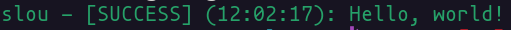
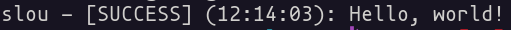
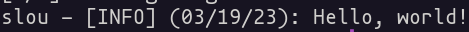
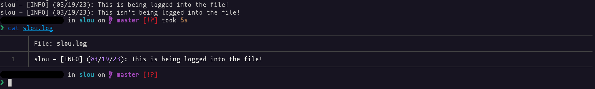
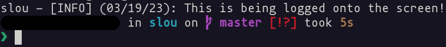

# Usage and configuration
This file explains ways of configuration for slou or new features that have been added in the latest release.

**NOTE: This documentation uses version >=1.2.0.**

## Custom formatting
As of version `1.1.0`, slou supports custom formatting similar in use to the Python `logging` library.

There are four variables you can use to customize your log format:

- `{projectName}` - Name of your project
- `{level}` - Severity level
- `{time}` - Date and/or time
- `{message}` - Your log message
- `{moduleName}` - Your module name (e.g. class name). New as of `v1.2.0`

To customize your format, you need to add it as a constructor argument:

```cpp
#include <slou/slou.hpp>

int main()
{
    // You can create a new variable with your custom format, or pass it directly to the format() function.
    std::string format = "{projectName} - [{level}] ({time}): {message}";

    slou::Logger logger("slou");

    logger.format(format); // This function is new as of v1.2.0

    logger.Log(logger.INFO, "Hello, world!");

    return 0;
}
```

The output:

```
slou - [INFO] (22:56:40): Hello, world!
```

You can obviously change the formatting to exclude some info from the log like for example the time, which would output:

```
slou - [INFO]: Hello, world!
```

The `format` variable would look something like this:

```cpp
std::string format = "{projectName} - [{level}]: {message}";
```

And that's all you need to know to format your logs however you like. Happy formatting! :)

## Coloring terminal output
As of version `v1.1.1`, you can decide whether you want to color terminal output or not. This is done using the `colorTerminalOutput` variable after you create an instance of The Logger.

```cpp
#include <slou/slou.hpp>

int main()
{
    slou::Logger logger("slou");

    logger.logToScreen(true); // This function is new as of v1.2.0

    // By default colorTerminalOutput is set to true.
    logger.colorTerminalOutput = true;

    logger.Log(logger.SUCCESS, "Hello, world!");

    return 0;
}
```

If you set `colorTerminalOutput` to `true` or leave it unchanged, the following would be the terminal output:

<p align="center"></p>

If you set `colorTerminalOutput` to `false`, the following would be the terminal output:

<p align="center"></p>

## Custom severity levels
Severity levels (like `SUCCESS` or `INFO`) are just strings containing text (like `SUCCESS` or `INFO`), which means you can customize and add your own severity levels.

To do that, you can change the first argument in the `Log()` function:

```cpp
#include <slou/slou.hpp>

int main()
{
    slou::Logger logger;

    logger.Log("Your custom severity level", "Hello, world!");

    return 0;
}
```

The resulting output would be:

<p align="center"></p>

## Changing time formatting
slou uses the `std::put_time()` function from the `iomanip` library.

If you'd like to change the default formatting, you need to change the second constructor argument:

```cpp
#include <slou/slou.hpp>

int main()
{
    slou::Logger logger("slou");

    logger.timeFormat("%x"); // This function is new as of v1.2.0

    logger.Log(logger.INFO, "Hello, world!");

    return 0;
}
```

In this example `%X` has been changed to `%x`, which instead of the current time, displays the current date:

Time format set to `%X`:

<p align="center"></p>

Time format set to `%x`:

<p align="center"></p>

If you'd like to see more ways of formatting your date and/or time, visit https://en.cppreference.com/w/cpp/io/manip/put_time.

## Changing constructor arguments on the fly
The Logger's constructor does two jobs, checking if the log file exists and if it does, removing it so a new one can be created, and initializing the constructor argument (and default values) to variables you can change on the fly.

Like for example the `logToFile` variable:

```cpp
#include <slou/slou.hpp>

int main()
{
    slou::Logger logger("slou");

    logger.logToScreen(true); // This function is new as of v1.2.0

    logger.Log(logger.INFO, "This is being logged into the file!");

    logger.logToFile(false); // This function is new as of v1.2.0
    logger.timeFormat("%x"); // This function is new as of v1.2.0

    logger.Log(logger.INFO, "This isn't being logged into the file!");
}
```

This will result in the following output:

<p align="center"></p>

Another example is the `logToScreen` variable:

```cpp
#include <slou/slou.hpp>

int main()
{
    slou::Logger logger("slou");

    logger.logToScreen(true); // This function is new as of v1.2.0

    logger.Log(logger.INFO, "This is being logged onto the screen!");

    logger.logToScreen(false); // This function is new as of v1.2.0

    logger.Log(logger.INFO, "This isn't being logged onto the screen!");
}
```

The above code, after execution, will result in the following output:

<p align="center"></p>
